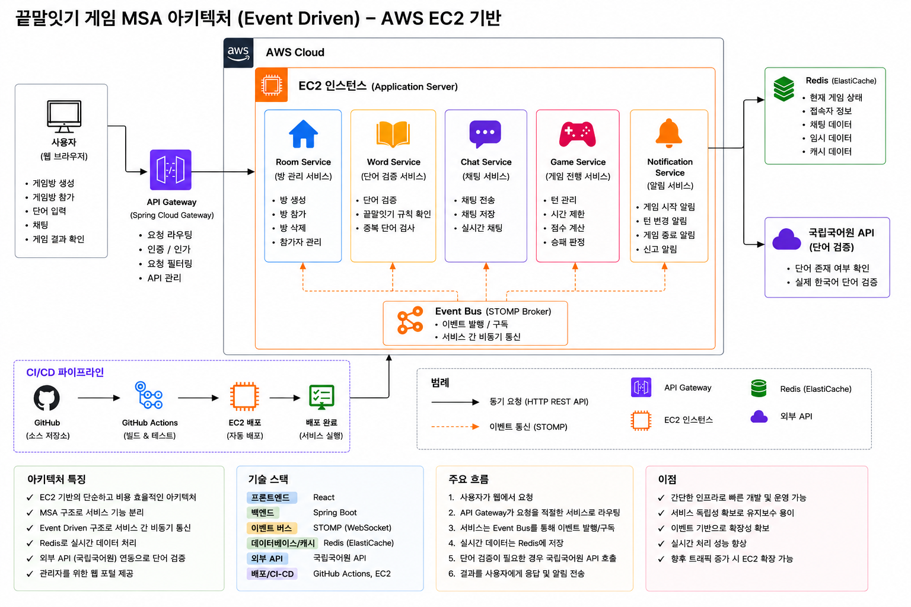

# 시스템 아키텍처

## 구조도



```
[ Client (React) ]
        |
        | ① HTTP REST API          ② WebSocket (STOMP)
        |   방 생성 · 참여              실시간 게임 이벤트 · 채팅
        ↓                                   ↓
┌─────────────────────────────────────────────────┐
│              Spring Boot (Kotlin)               │
│                                                 │
│   ┌─────────────┐       ┌───────────────────┐  │
│   │  REST API   │       │  WebSocket Handler │  │
│   │  Controller │       │  (STOMP Broker)   │  │
│   └──────┬──────┘       └────────┬──────────┘  │
│          │                       │             │
│   ┌──────▼───────────────────────▼──────────┐  │
│   │              Service Layer              │  │
│   │  GameRoomService / WordValidationService│  │
│   │  ChatService / GameSessionService       │  │
│   └─────────────────────┬───────────────────┘  │
│                         │                      │
│   ┌─────────────────────▼───────────────────┐  │
│   │           Redis (유일한 저장소)          │  │
│   │  방 상태 · 참가자 · 단어 Set · 채팅     │  │
│   └─────────────────────────────────────────┘  │
└─────────────────────────────────────────────────┘
        |
        | ③ 외부 API 호출
        ↓
[ 국립국어원 표준국어대사전 API ]
```

## 전체 게임 흐름

```
[방 생성]   POST /api/rooms
            → 방 코드(A3F9K2) + 세션 ID 발급
            → Redis 초기화 (TTL 2시간)

[방 참여]   POST /api/rooms/join
            → 세션 ID 발급 → Redis 플레이어 등록

[WS 연결]   ws://{host}/ws?roomCode=A3F9K2&sessionId=uuid
            → /topic/room/A3F9K2 구독

[게임 시작] 방장 → SEND /app/game/start
            → 턴 순서 결정 → BROADCAST: GAME_START

[게임 진행] 턴 플레이어 → SEND /app/game/word { "word": "사과" }
            → KAN-16 끝말 검증 → KAN-36 사전 검증
            → 성공: BROADCAST WORD_RESULT → 다음 턴
            → 실패/타임아웃: BROADCAST TURN_TIMEOUT → 탈락

[게임 종료] 최후 1인 → KAN-66 BROADCAST GAME_OVER → Redis 삭제

[호스트 퇴장] SessionDisconnectEvent → KAN-67 BROADCAST ROOM_CLOSED → Redis 삭제
```
